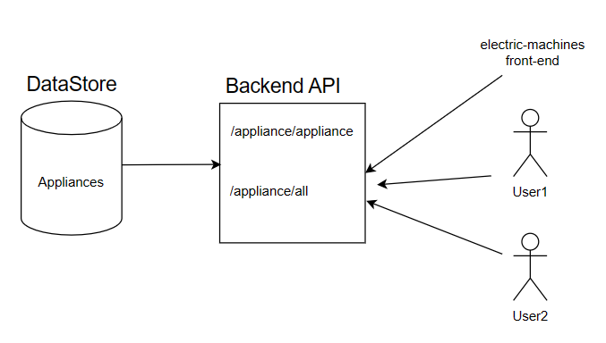

# Backend API
<!-- @import "[TOC]" {cmd="toc" depthFrom=1 depthTo=6 orderedList=false} -->

The backend API service is built using Typescript and fastify web framework. This API service loads all data into memory upon startup and perform searching within the loaded data store instead of replying on a dedicated database service. Two functions that this API provided are:

1. `GET appliance/appliance`: Enable users to look upon appliances with the matching criteria.
2. `GET appliance/all`: Returns all raw appliance data back to the requester without any modification.

- Command to build in local: `npm run build-local`
- Command to start service in localhost (port 8080): `npm start`

### Appliance Parameters
| Parameter 	| Mandatory 	| Supported Appliances 	| Comment 	|
|---	|---	|---	|---	|
| applianceType 	| Y 	| ALL 	| Mandatory for every request. `hpwh` for water-heaters, `hpd` for dryers, `hphvac` for HVACs and `stove` for stove appliance data  	|
| weight 	|  	| ALL 	| Numerical value for weight 	|
| weightUnit 	|  	| ALL 	| The searching and display unit for weights. Defaults to `lb` if not provided. 	|
| dimensionUnit 	|  	| ALL 	| The display unit for dimensions. Defaults to `in` if not provided 	|
| electricalBreakerSize 	|  	| ALL 	| The maximum breaker size in amperage that appliances can handle. 	|
| voltage 	|  	| ALL 	| The maximum voltage that appliances can handle. 	|
| tankCapacityMin 	|  	| water-heater 	| Minimum tank capacity for water-heaters, measured in US gallon. 	|
| tankCapacityMax 	|  	| water-heater 	| Maximum tank capacity for water-heaters, measured in US gallon. 	|
| uniformEnergyFactor 	|  	| water-heater 	| Minimum efficiency that water-heaters should have. 	|
| firstHourRating 	|  	| water-heater 	| Minimum first hour rating that water-heaters should have 	|
| capacityMin 	|  	| dryer 	| Minimum load capacity for dryers, measured in cubic feet. 	|
| capacityMax 	|  	| dryer 	| Maximum load capacity for dryers, measured in cubic feet. 	|
| soundLevel 	|  	| dryer 	| Maximum acceptable sound level for dryers, measured in decibel. 	|
| combinedEnergyFactor 	|  	| dryer 	| Minimum efficiency that dryers should have. 	|
| tonnageMin 	|  	| HVAC 	| Minimum tonnage that an HVAC can make change in air in an hour. 	|
| tonnageMax 	|  	| HVAC 	| Maximum tonnage that an HVAC can make change in air in an hour. 	|

### Notable Third-party Libraries
- [factify v4.26.2](https://fastify.dev/)
- [json-schema-to-ts v3.0.1](https://www.npmjs.com/package/json-schema-to-ts/v/3.0.1)
- [convert-units v3.0.0-beta.6](https://www.npmjs.com/package/json-schema-to-ts/v/3.0.1)

## Recommend Hosting
The source code of the backend-API and its associated data are both resided in GitHub. The service itself is deployed onto the Vercel directly. 

Appliance data are stored as json files as there is not a significant amount of data. When data storage with the filesystem become the bottleneck of backend service, an alternative solution is to create a Postgres database with tables maps to each of the appliances the (schema)[schema] provided and deploy the database onto 

## Application Deployment 
The backend API service is deployed onto the Vercel platform. Refer to the [official documentation](https://vercel.com/) regarding account creation and project management. To deploy the current branch onto vercel for testing and development purposes, run `vercel`. Once the result is satisfactory, deploy to the production environment by running `vercel --prod`

## Authentication and Authorization 
Due to no inclusion of sensitive or personal data, authentication and authorization are not required, therefore they were not implemented at this stage in time. Rewiring America can add an API key authentication layer on top of this backend service with relative ease if necessary.
 
## Database Backup
All appliance data for the backend API service are stored inside the [data](data) directory. GitHub is actively being utilised for data versioning as well as backup copies. Furthermore, there are no privacy or other regulatory concerns about storing the data directly on GitHub due to all data being publicly available.

## Environment Variables
Not applicable. 